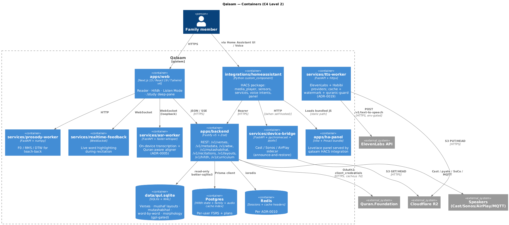
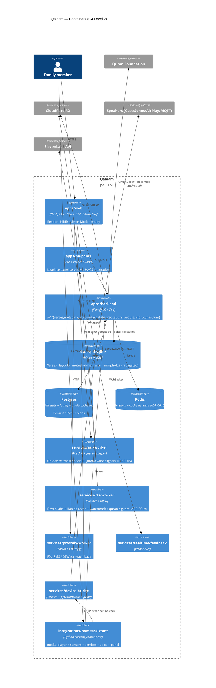

# Qalaam — C4 Level 2: Containers



> **Diagram sources:** `c4-containers.puml` (re-render via `scripts/docs/render-c4-png.sh`); the Mermaid block below renders natively on GitHub.



ASCII fallback (for terminals where Mermaid doesn't render):

```
┌────────────────────────────────────────────────────────────────────────────┐
│                                Web tier                                     │
│  ┌──────────────────────────────────────────────────────────────────────┐  │
│  │  apps/web (Next.js 15 + React 19 + React Compiler 1.0)                │  │
│  │   ├── React Server Components → backend HTTP                         │  │
│  │   ├── packages/ui (design system)                                    │  │
│  │   ├── packages/ui-quran (mushaf renderer + ayah card)                │  │
│  │   ├── packages/ui-hifdh (parent dashboard, rating, streak)           │  │
│  │   └── packages/adapter-web (browser-as-speaker)                      │  │
│  └──────────────────────────────────────────────────────────────────────┘  │
└────────────────────────────────────────────────────────────────────────────┘
                                      │ HTTPS
                                      ▼
┌────────────────────────────────────────────────────────────────────────────┐
│                            API tier (Fastify v5)                            │
│  ┌──────────────────────────────────────────────────────────────────────┐  │
│  │  apps/backend                                                         │  │
│  │   ├── /healthz, /v1/verses/*, /v1/chapters/*, /v1/recitations        │  │
│  │   ├── packages/api-client-ts (QF Tier A; ToS ≤ 7d cache)             │  │
│  │   ├── packages/data-loader (QUL SQLite; falls back to fixtures)      │  │
│  │   ├── packages/hifdh-engine (FSRS-6 sessions)                        │  │
│  │   ├── packages/khatm + packages/azkar                                │  │
│  │   └── packages/adhan (prayer times, qibla, hijri)                    │  │
│  └──────────────────────────────────────────────────────────────────────┘  │
└────────────────────────────────────────────────────────────────────────────┘
            │                            │                            │
            ▼                            ▼                            ▼
┌──────────────────────┐  ┌──────────────────────┐  ┌────────────────────────┐
│  Postgres (Supabase) │  │  Redis (Upstash)     │  │  Cloudflare R2          │
│   schema mirrors     │  │   FSRS due-queue     │  │   audio cache           │
│   packages/schema    │  │   session state      │  │   (zero-egress)         │
└──────────────────────┘  └──────────────────────┘  └────────────────────────┘
                                      │
                                      │ HTTP/JSON (LAN-only in dev/prod)
                                      ▼
┌────────────────────────────────────────────────────────────────────────────┐
│                          Sidecar tier (Python)                              │
│  ┌────────────────────────┐  ┌────────────────────────┐  ┌──────────────┐  │
│  │ services/device-bridge │  │  services/asr-worker   │  │ services/    │  │
│  │   pychromecast (Cast)  │  │  faster-whisper +      │  │ tts-worker   │  │
│  │   pyatv (AirPlay 2)    │  │  Tarteel-tuned model   │  │   ElevenLabs │  │
│  │                        │  │  AUDIO NEVER LEAVES    │  │   or Habibi  │  │
│  │                        │  │  THE DEVICE (ADR-0005) │  │   (post v2)  │  │
│  └────────────────────────┘  └────────────────────────┘  └──────────────┘  │
└────────────────────────────────────────────────────────────────────────────┘
                                      │
                                      ▼
┌────────────────────────────────────────────────────────────────────────────┐
│                        HA tier (optional, user-owned)                       │
│  ┌──────────────────────────────────────────────────────────────────────┐  │
│  │  integrations/homeassistant/custom_components/qalaam                  │  │
│  │   ├── manifest.json (HACS-installable, hub, cloud_polling)           │  │
│  │   ├── coordinator.py → backend /v1/reciters                          │  │
│  │   ├── media_player.py → proxies to user-chosen target                │  │
│  │   ├── media_source.py → media-source://qalaam/...                    │  │
│  │   └── services.yaml (play_ayah, play_surah, start_session)           │  │
│  └──────────────────────────────────────────────────────────────────────┘  │
└────────────────────────────────────────────────────────────────────────────┘
```

## Deployment topologies

**SaaS:** apps/web on Vercel; apps/backend + Python sidecars on Hetzner; Postgres on Supabase; Redis on Upstash; R2 on Cloudflare. Browser tab is also a Speaker via the web adapter.

**Self-hosted:** all of the above as `docker compose up` on the user's own hardware. Uses the same Postgres + Redis services bundled in the compose file.

**HA-native:** the HA integration calls Qalaam SaaS for catalog metadata, then re-exposes it locally. ASR + Hifdh state still live on Qalaam's backend; HA is the routing surface.
