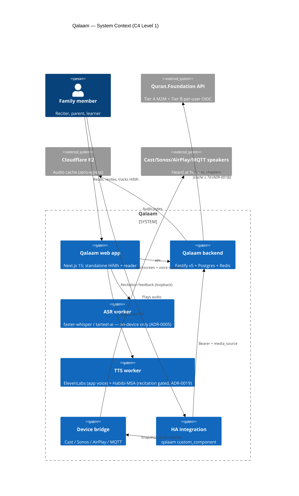

# Qalaam — C4 Level 1: System Context

> **Diagram sources:** `c4-context.puml` (PlantUML w/ C4-PlantUML stdlib — high-fidelity render via `scripts/docs/render-c4-png.sh`); the Mermaid block below renders natively on GitHub.



ASCII fallback (for terminals where Mermaid doesn't render):

```
                                          ┌─────────────────────────┐
                                          │  Quran.Foundation API   │
                                          │  (Content Tier A M2M)   │
                                          └────────────┬────────────┘
                                                       │ HTTPS (cache ≤ 7d)
                                                       │
   ┌──────────────────┐    ┌──────────────────┐    ┌──▼─────────────────┐    ┌──────────────────┐
   │   Family / user  │───▶│   Qalaam web     │───▶│   Qalaam backend   │───▶│   Cloudflare R2  │
   │   (browser/PWA)  │◀───│   (Next.js 15)   │◀───│   (Fastify v5)     │    │  (audio cache)   │
   └──────────────────┘    └────────┬─────────┘    └──┬───────┬─────────┘    └──────────────────┘
            │                        │                 │       │
            │ Lockscreen              │                 │       │
            ▼                        ▼                 ▼       ▼
   ┌──────────────────┐      ┌──────────────────┐    ┌────────────────────┐
   │  Browser tab as  │      │  Home Assistant  │    │  ASR worker        │
   │  speaker (Web    │      │  (HACS install)  │    │  (faster-whisper,  │
   │  Adapter)        │      │  qalaam custom_  │    │  on device only —  │
   └──────────────────┘      │  component       │    │  ADR-0005)         │
                             └────┬─────────────┘    └────────────────────┘
                                  │ media_player.play_media
                                  ▼
                          ┌──────────────────────────────────────────────┐
                          │  Cast / Sonos / AirPlay / DLNA / MQTT speakers│
                          │  inherited via HA-as-adapter                  │
                          └──────────────────────────────────────────────┘
```

## Boundaries

- **Inside Qalaam:** apps/web, apps/backend, services/{device-bridge, asr-worker, tts-worker}, integrations/homeassistant, all packages/\*.
- **Outside but trusted:** Quran.Foundation API (content), Cloudflare R2 (audio cache), Supabase (Auth + Postgres per ADR-0010 + ADR-0012).
- **Outside, user-owned:** browser, HA install, smart speakers on the LAN.

## Audit notes (per ADR-0005)

- Audio NEVER leaves the device. The ASR worker is co-located with the user (in-app, on a Pi, or on the family LAN). No audio crosses the trust boundary into Cloudflare R2 or Supabase.
- The TTS worker DOES touch ElevenLabs API in MVP path (per ADR-0014), but only outbound text → audio. No user audio in either direction.

## Outcome traceability

| Element                                       | Outcome served                                                             |
| --------------------------------------------- | -------------------------------------------------------------------------- |
| Web ↔ backend ↔ data-loader                   | O-01 (mistake-detection latency upper bound: backend < 50ms p95)           |
| ASR worker on-device                          | O-02 (false-positive reduction with rapid local feedback) + O-03 (offline) |
| HA-as-adapter + direct device-bridge          | O-09 (smart-home integration) + O-13 (ambient passive playback)            |
| Hifdh engine (FSRS-6)                         | O-04 (parent cognitive load) + O-05 (mutashabihat) + O-07 (retention)      |
| Family Plan + ParentDashboard + KhatmTracking | O-04 (parent supervision multi-child) + O-08 (group khatm coordination)    |
